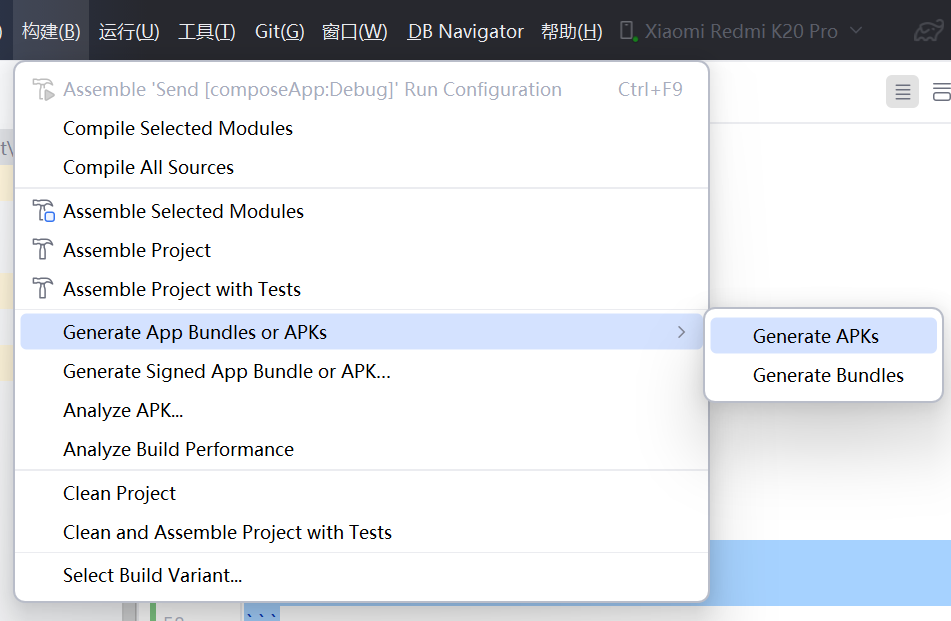

# 计算机网络课程设计
## 选题
局域网传输（题号2）
## 组员：
1. 2023***529 界面与交互设计、项目的骨架搭建、文本和文件的收发功能、发现设备功能
2. 2023***155 待定
3. 2023***601 待定

## 需求
局域网内发送、接收文本或文件

## 设计参考
以 LocalSend 的功能为原型设计，未参考其源代码（只是一个课设，只需要实现基本功能即可）

## 技术调研

### 网络层
- 设备查找：UDP
- 数据传输：TCP

### 界面层
- 跨平台适配：Compose Multiplatform

### 逻辑层
- 跨平台适配：Kotlin Multiplatform
- 跨设备传输：Java(java.net)，以 Json 为载体

## 项目目录简介


## 编译运行
1. [安装 Android Studio](https://developer.android.com/studio)
2. 用 Android Studio 打开此项目并等待构建完成（构建时必须使用 Clash 的 Tun 模式）
3. 以 Debug 环境运行
- 在 PC 上运行
```bash
./gradlew composeApp:run
```
- 在 Android 设备上运行：选择 composeApp 上面的运行图标


4. 打包

- 打包 PC 版

```bash
./gradlew composeApp:packageDistributionForCurrentOS 
```

- 打包 Android Debug 版



## 后续完善（优先级高到低排序）
1. UI层：PC 端支持拖拽文件 分配给2023***529
2. UI层：接收界面右下角FAB，文件传输中的界面  分配给2023***529
3. 逻辑层：多文件、多接收者并行发送（对应也要UI层的支持，转任务2） 分配给2023***529
4. 整体：软件整体架构的梳理，绘制导图用于实验报告 可向外分配
5. 逻辑层：目前的中止传输方式是强制切断连接，可以优化改造成更优雅的方式告知对方关闭连接 可向外分配
6. UI层：引入全局转场动画体系 分配给2023***529
7. 整体：文件传输和文本传输UI层完全合并 分配给2023***529
8. 整体：软件自我更新 分配给2023***529
9. UI层：完善界面与交互细节 分配给2023***529