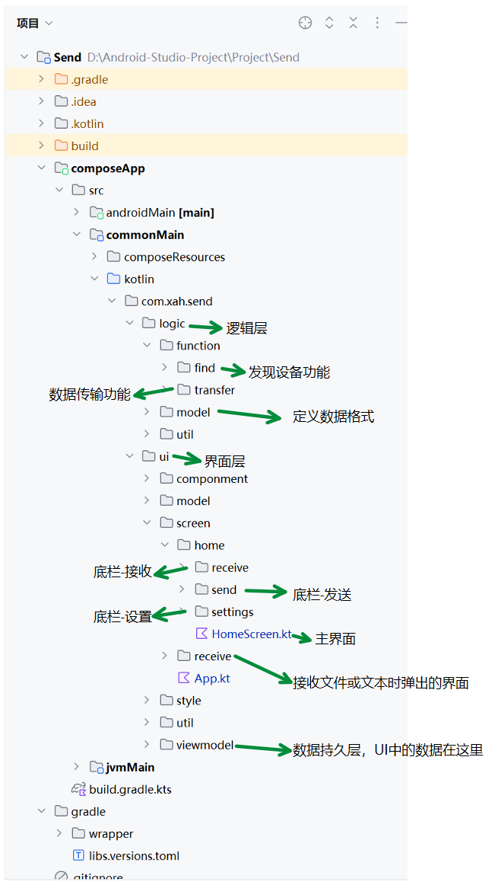
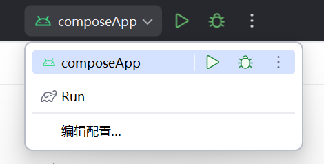

# 计算机网络课程设计
局域网传输 App

## 需求
局域网内发送、接收文本或文件

## 小组分工
- XXXXXXX529 项目的骨架搭建、发现设备功能、数据(文件、文本)发送与接收
- XXXXXXX601 
- XXXXXXX155 

## 设计参考
以 LocalSend 的功能为原型设计，未参考其源代码（只是一个课设，只需要实现基本功能即可）

## 技术调研

### 网络层
- 设备查找：UDP
- 数据传输：TCP

### 界面层
- 跨平台适配：Compose Multiplatform

### 逻辑层
- 跨平台适配：Kotlin Multiplatform
- 跨设备传输：Java(java.net)，以 Json 为载体

## 总代码行数
2153行（不算空白行）

## 项目目录简介


## 编译运行
1. [安装 Android Studio](https://developer.android.com/studio)
2. 用 Android Studio 打开此项目并等待构建完成
3. 以 Debug 环境运行
- 在计算机上运行
```bash
./gradlew composeApp:run
```
- 在 Android 设备上运行：选择 composeApp 上面的运行图标

